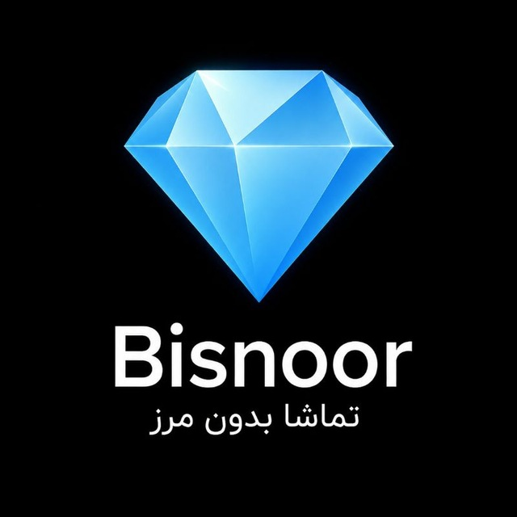

<div align="center">



# Bisnor

### تماشا بدون مرز 💎

یک کلاینت متن‌باز برای مرور، جستجو و پخش فیلم و سریال با تمرکز روی تجربه فارسی، رابط سبک و پخش انعطاف‌پذیر.

<br>

[](https://github.com/nikan48g/Bisnor/stargazers)
[](https://github.com/nikan48g/Bisnor/forks)
[](https://github.com/nikan48g/Bisnor/issues)
[](LICENSE)

<br>


</div>

---

## 🎬 درباره Bisnor

**Bisnor** یک پروژه چندپلتفرمی برای تجربه تماشای فیلم و سریال است. **Android** خانه اصلی پروژه است، **Windows Desktop** مسیر جانبی توسعه را طی می‌کند و توسعه نسخه **Samsung Tizen TV** به‌دلیل مشکلات سازگاری پخش متوقف شده است. نسخه وب و دسترسی از iOS هنوز منتشر نشده‌اند.

Bisnor یک **client / frontend مستقل** است و برای دریافت اطلاعات و دسترسی به محتوای رسانه‌ای از زیرساخت و سرویس‌های **IranFlix** استفاده می‌کند.

> **بیسنور، تماشا بدون مرز 💎**

---

## 💎 خانواده بیسنور؛ بعضی‌ها محبوب‌ترند!

> پنج پلتفرم، یک الماس و البته بودجه توسعه‌ای که هنوز نامحدود نشده! 🍿

<table>
<tr>
<td width="85" align="center">💚<br><b>Android</b></td>
<td><b>❤️ اولویت اصلی</b><br><br>قلب بیسنور! تمام عشق، بهبود پلیر، سرعت و شب‌بیداری‌های رفع باگ تقدیم این نسخه می‌شود. بچه محبوب خانواده است، اعتراض هم وارد نیست. 👑</td>
</tr>
<tr>
<td align="center">🪟<br><b>Windows</b></td>
<td><b>🧪 توسعه جانبی</b><br><br>برای کسانی که دوست دارند روی لپ‌تاپ فیلم ببینند. دوستش داریم، اما فعلاً لازم نیست تمام امکاناتش هم‌سطح اندروید باشد. فرزند دوم خانواده هنوز سرپرست دارد! 💻</td>
</tr>
<tr>
<td align="center">📺<br><b>Tizen</b></td>
<td><b>🛑 توسعه متوقف شده</b><br><br>پلیر با بعضی فایل‌های MKV و کدک‌های سرور به توافق نرسید؛ نتیجه‌اش لگ و کرش بود. قبل از اینکه تلویزیون درخواست استعفا بدهد، این نسخه را بازنشسته کردیم. کد قدیمی ممکن است برای مراجعه و آرشیو باقی بماند. 🪦</td>
</tr>
<tr>
<td align="center">🌐<br><b>Web</b></td>
<td><b>💭 ایده آینده؛ هنوز منتشر نشده</b><br><br>شاید روزی بتوان بیسنور را مستقیم در مرورگر اجرا کرد. فعلاً مرورگر مسئول دیدن سایت و دانلود برنامه است؛ نقش بازیگر اصلی را به او نداده‌ایم. 🎬</td>
</tr>
<tr>
<td align="center">🍎<br><b>iOS</b></td>
<td><b>📱 اپ اختصاصی ندارد</b><br><br>قرار نیست فعلاً یک نسخه نیتیو iOS بسازیم. اگر نسخه وب مناسب در آینده عرضه شود، کاربران آیفون می‌توانند آن را با Safari باز کنند و در صورت پشتیبانی لازم، از گزینه <b>Add to Home Screen</b> مثل یک وب‌اپ به صفحه اصلی اضافه کنند. سیب و الماس هنوز قرارداد امضا نکرده‌اند! 🍏</td>
</tr>
</table>

<sub>توجه: افزودن سایت به صفحه اصلی به معنی وجود اپ رسمی iOS نیست؛ قابلیت نصب‌پذیری و تجربه شبیه اپ به پیاده‌سازی نسخه وب وابسته است.</sub>

---

## ✨ قابلیت‌های اصلی

- 🎥 مرور فیلم و سریال
- 🔎 جستجوی محتوا، بازیگر و کارگردان
- ❤️ Watchlist و Playlist
- 📺 پخش آنلاین
- 🎞️ نمایش فصل‌ها و قسمت‌ها
- ▶️ پلیر داخلی Media3 / ExoPlayer
- 📱 پشتیبانی از پلیرهای خارجی
- ⏯️ ادامه پخش و ذخیره موقعیت
- ⏭️ Next Episode
- 📥 دانلود محتوا
- 🧠 Smart Taste و پیشنهاد محتوا
- 👤 حساب کاربری، آواتار و Sync
- 🌙 Light / Dark Theme
- 🇮🇷 رابط فارسی و فونت Vazirmatn

---

## 📦 دانلود

[](https://github.com/nikan48g/Bisnor/releases/latest)

### 🪟 نصب نسخه Windows با WinGet

```powershell
winget install --id HNN.Bisnor -e
```

> 💚 Android پلتفرم اصلی است؛ Windows نسخه جانبی و آزمایشی است؛ توسعه Tizen متوقف شده. نسخه وب و iOS فعلاً خروجی منتشرشده ندارند.

---

## 📚 مستندات

- 🛠️ [راهنمای کامل Build برای Android، Windows و Tizen](docs/BUILD.md)
- 🐛 [راهنمای Troubleshooting و خطاهای رایج](docs/TROUBLESHOOTING.md)

---

## 💎 Powered by IranFlix

Bisnor برای دریافت اطلاعات و دسترسی به محتوای فیلم و سریال از زیرساخت و سرویس‌های **IranFlix** استفاده می‌کند.

سرویس‌ها، APIها، داده‌ها، زیرساخت و محتوای رسانه‌ای شخص ثالث تحت مالکیت و شرایط صاحبان مربوطه هستند و مشمول مجوز MIT این Repository نمی‌شوند.

---

## 🧱 ساختار Repository

```text
Bisnor/
├─ app/                    # Android
├─ desktop/                # Windows Desktop
├─ tizen-tv/               # Samsung Tizen TV
├─ packaging/              # Windows packaging / WinGet
├─ docs/                   # Documentation
└─ .github/workflows/      # CI / Release workflows
```

---

## 🛠️ تکنولوژی‌ها

| Technology | Usage |
|---|---|
| Android SDK / Kotlin | Android app |
| Media3 / ExoPlayer | Video playback |
| Retrofit / OkHttp | Networking |
| Supabase | Account / sync |
| WPF / .NET 10 / WebView2 | Windows Desktop |
| HTML / CSS / JavaScript | Desktop and Tizen UI |
| Tizen Web API / AVPlay | Samsung TV |

---

## 🔐 امنیت

اطلاعات حساس مانند Service Role Keys، Database Passwords، Private Tokens، Signing Keys، Keystoreها و Certificateها نباید داخل Repository عمومی قرار بگیرند.

---

## 🤝 مشارکت

Pull Request و Bug Report پذیرفته می‌شود. در PR توضیح دهید چه چیزی تغییر کرده، چرا لازم بوده و روی کدام پلتفرم اثر دارد.

---

## 🐞 گزارش مشکل

[](https://github.com/nikan48g/Bisnor/issues)

در گزارش، نسخه Bisnor، پلتفرم، نسخه سیستم‌عامل، مراحل بازتولید و Log مرتبط را اضافه کنید. اطلاعات حساس را داخل Issue عمومی منتشر نکنید.

---

## ⚖️ Disclaimer

Bisnor یک نرم‌افزار **client / frontend** است و این Repository به خودی خود میزبان یا مالک فیلم‌ها، سریال‌ها یا فایل‌های رسانه‌ای شخص ثالث نیست.

---

## 📄 License

Bisnor تحت مجوز **MIT License** منتشر شده است.

[](LICENSE)

---

<div align="center">

[](https://github.com/nikan48g/Bisnor)

<br>

**Bisnor**  
تماشا بدون مرز 💎

Powered by **IranFlix**

Made with ❤️ by **HNN**

</div>
